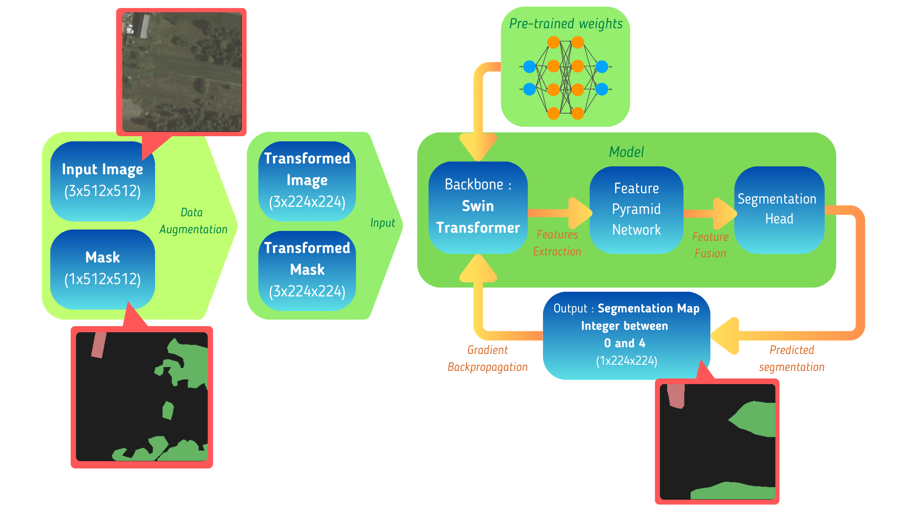
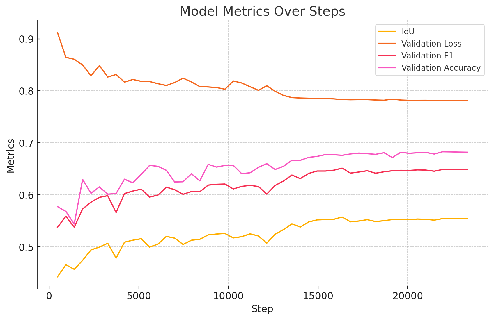

# ML4Earth Hackathon 2024 - Introduction

This is the home project for our team's submission to the [ML4Earth2024 Hackathon](https://github.com/zhu-xlab/ML4Earth-Hackathon-2024)


## Project Overview

In this hackathon, our goal was to develop a robust mapping framework capable of **generating high-resolution maps** from aerial imagery using the [LandCover.ai Dataset](https://landcover.ai.linuxpolska.com/). We focused on applying supervised machine learning techniques, specifically utilizing a pretrained foundation model, **Swin2B**, for image segmentation. By fine-tuning this model, we aimed to accurately classify land cover types such as roads, buildings, and vegetation. Our ultimate objective was to create a scalable solution that could be used for urban planning, environmental monitoring, and disaster response applications.

## Dataset

The LandCover.ai dataset consists of high-resolution **RGB** aerial images, each with a spatial resolution of 0.25m or 0.5m per pixel. The dataset includes 33 tiles, each with dimensions of 9000x9500 pixels, covering various regions in Poland, that are then split into 7470 training, 1602 validation and a further 1602 test 3x512x512 images. All images except those in the test category also have corresponding manually annotated data put into four primary classes: buildings, woodlands, water, and roads, with pixel-wise **masks** provided for supervised learning.

Our exploration of the dataset is documented in the [data_explo.ipynb](data_explo.ipynb) file.

## Methodology

Our approach to generating high-resolution land cover maps involves several key components: data preparation, model architecture design, training procedure, and evaluation. Below, we detail each of these steps.

### Data Preparation


To enhance the generalization capability of our model, we implemented a custom data augmentation pipeline using PyTorch and torchvision transforms. This pipeline is encapsulated in our TrainTransform class and includes the following transformations:

- Random Resized Crop: Crops a random portion of the image and resizes it to a standard size, allowing the model to become invariant to scale and aspect ratio changes.
- Color Jitter: Randomly changes the brightness, contrast, saturation, and hue of the image to make the model robust to color variations.
- Random Rotation: Rotates the image by a random degree within a specified range, helping the model handle images captured from different orientations.
- Random Horizontal Flip: Flips the image horizontally with a certain probability, enabling the model to learn symmetrical features.

Importantly, these transformations are applied to both the RGB images and their corresponding masks (except for color jitter, which is only applied to images) to maintain alignment between inputs and labels. All the transformation values can be controlled directly via config in a yaml file, but for Resizing we chose a standard size of 224x224, considering the compute limitation of operating on a single, local GPU.

### Model Architecture



#### 1. Backbone (Swin Transformer)

- We utilized the SwinV2-B variant of the Swin Transformer, pre-trained on the Sentinel-2 satellite imagery dataset. This provides a strong foundation for understanding aerial images. We experimented with freezing different first layers of the backbone and ended up determining that TODO.
- The backbone extracts hierarchical feature representations at different scales, which are essential for segmenting objects of varying sizes.

#### 2. Feature Pyramid Network (FPN)

- The FPN is employed to merge feature maps from different stages of the backbone, creating a rich multi-scale feature representation. By combining low-level spatial details with high-level semantic information, the FPN enhances the model's ability to localize small and large objects alike.
- We used torchvision's create_feature_extractor to obtain feature maps from specific layers of the Swin Transformer:

  - "features.2.add" corresponds to the output after the second Swin Transformer block.
  - "features.4.add" corresponds to the output after the fourth block.

These layers were chosen to balance the computational load and the granularity of features.

#### 3. Segmentation Head

- A lightweight segmentation head processes the FPN's output to generate the final prediction.
- It consists of a sequence of convolutional layers:

  - A Conv2d layer reducing the number of channels to 128, followed by a ReLU activation.
  - A final Conv2d layer that maps the features to the desired number of classes (four in our case: background, buildings, woodlands, water, roads).
- The output is upsampled using bilinear interpolation to match the input image dimensions.

## Training Procedure

Our training process was centered around maximizing the segmentation performance while ensuring efficient utilization of available resources.
The training was done using the PyTorch Lightning framework. We implemented the following key steps:

### 1.Optimizer and Learning Rate Scheduler

- We used the **Adam** optimizer.
- We implemented a **ReduceLROnPlateau** learning rate scheduler to reduce the learning rate when the validation performance metric—Intersection over Union (IoU)—plateaued.

### 2. Loss Function

For the loss function, we utilized a *Cross-Entropy* Loss with **class weighting** and **label smoothing** to address class imbalance and improve the generalization capabilities of the model:

- Class weights: These were derived from the dataset to give higher importance to under-represented classes like roads and buildings.
- Label smoothing: A value of 0.1 was used to smooth labels during training, preventing the model from becoming overconfident and improving its ability to generalize.

### 3. Metrics, Proffiling, Early stopping, and observability

We tracked multiple metrics during training and validation, and used tensorboard as our real-time observability tool. To facilitate efficient debugging and performance tracking, we also also used [pytorch's integrated profiler](https://pytorch.org/docs/stable/profiler.html) for memory and compute profiling.

You can visualize them yourself as we've included those of our best performing model's training runs in the runs folder. To start tensorboard and visualize them, run the following command:

```
python -m tensorboard.main --logdir=runs
```

These also contain an autogenerated log detailing complete model architecture.

Metrics tracked: IoU, Accuracy, Precision, Recall, F1 Score, loss (For both training and validation) time/epoch, time/batch.

### 4. Training Loop

We ran the training on a local NVIDIA GeForce RTX 3060 GPU with the following key configurations (you can view the full list of configurations in the [config.py](config.py) file):

- **Batch size**: 16
- **Epochs**: 50
- Precision: 32 bit
- **Early Stopping**: Patience of 10 epochs for monitoring validation IoU, allowing us to stop training if there was no improvement.
- **Gradient Accumulation**: We employed gradient accumulation with a step size of 2, optimizing the model using accumulated gradients over batches for smoother learning.
- **Checkpointing**: We used ModelCheckpoint to save the best model based on **validation IoU**.

## Results

With a max IoU of 0.557, a max F1 Score of 0.651, and validation accuracy peaking at 0.683 on our most successful run, our model demonstrates strong segmentation capabilities, particularly in distinguishing between different land cover types such as roads, buildings, and vegetation. While the performance shows clear improvements over time, there are still some fluctuations in metrics like IoU and validation loss, suggesting room for further fine-tuning.

Vizualising the inferred masks and comparing them to their ground truth showed that while the model performs well for the two most present classes, Background and Building, it performs worse on water, and significantly worse on roads and buildings. We believe this is partly due to the class imbalance in the dataset, partly to the fact we had to downscale the images, and more efforts could be made to improve the model's performance.

As for inference time, our model was able to infer the masks in just 0.5 seconds on a local machine.



## Challenges & Limitations

- Dealing with the class imbalance in the dataset, certain classes like roads and buildings are underrepresented.
- Optimizing the model’s training on a local GPU, which required efficient memory and compute resource management. Training approximated a couple of hours, even after scaleing images down to 225x225.
- Despite our best efforts, we faced difficulty improving certain performance metrics. For instance, our model's IoU, validation accuracy, and F1 score did not exceed X, X, and X, respectively.
- Initially, we tried using TerraTorch for model training, but it proved to be too slow on our local machine, hindering our ability to iterate quickly. We decided we would both learn more and have more control over where compute resources are spent by making our own run and config handler.

## Note on Code Structure

Although Jupyter notebooks are commonly used for developing and showcasing machine learning projects, the majority of our code is implemented in Python scripts due to a technical limitation on Windows. Specifically, when running PyTorch with CUDA in a Jupyter notebook, there are issues with how the ipykernel handles threads, which can prevent efficient GPU utilization (see PyTorch Issue [#12831](https://github.com/pytorch/pytorch/issues/12831)).

To ensure full access to CUDA and maximize GPU performance, we opted for script-based training and inference. This approach also aligns with our goal of reducing energy consumption by running on a local desktop GPU, rather than relying on remote cloud servers.

However, we provide a [Jupyter notebook](/src/training_cookbook.ipynb) as a setup guide to help users with installation and configuration steps, including how to run the main functions in the project.

## References

[LandCover.ai Dataset](https://landcover.ai.linuxpolska.com/)

[Pre-trained Backbone](https://github.com/allenai/satlaspretrain_models/?tab=readme-ov-file#sentinel-2-pretrained-models)

Papers on Swin Transformer:

- [Swin Transformer:  Swin Transformer V2: Scaling Up Capacity and Resolution](https://arxiv.org/pdf/2111.09883v2.pdf)

- [ Swin Transformer: Hierarchical Vision Transformer using Shifted Windows](https://arxiv.org/pdf/2103.14030v2.pdf)

[JupyterNotebooks + Windows + Cuda = 🤯](https://github.com/pytorch/pytorch/issues/12831)
