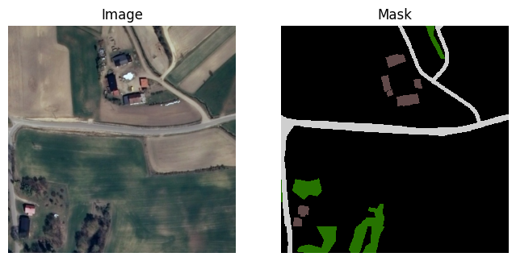

# ML4Earth Hackathon 2024 - Introduction

This is the home project for our team's submission to the [ML4Earth2024 Hackathon](https://github.com/zhu-xlab/ML4Earth-Hackathon-2024)

TODO: Image Intro

## Project Overview

In this hackathon, our goal was to develop a robust mapping framework capable of generating high-resolution maps from aerial imagery using the [LandCover.ai Dataset](https://landcover.ai.linuxpolska.com/). We focused on applying supervised machine learning techniques, specifically utilizing a pretrained foundation model for image segmentation. By fine-tuning this model, we aimed to accurately classify land cover types such as roads, buildings, and vegetation. Our ultimate objective was to create a scalable solution that could be used for urban planning, environmental monitoring, and disaster response applications.

## Dataset

The LandCover.ai dataset consists of high-resolution RGB aerial images, each with a spatial resolution of 0.25m per pixel. The dataset includes 33 tiles, each with dimensions of 9000x9500 pixels, covering various regions in Poland, that are then split into 7470 training, 1602 validation and a further 1602 test images. All images except those in the test category also have corresponding manually annotated data put into four primary classes: buildings, woodlands, water, and roads, with pixel-wise **masks** provided for supervised learning.

Our exploration of the dataset is documented in the [data_explo.ipynb](data_explo.ipynb) file.

## Methodology

## References

[LandCover.ai Dataset](https://landcover.ai.linuxpolska.com/)

[Pre-trained Backbone](https://github.com/allenai/satlaspretrain_models/?tab=readme-ov-file#sentinel-2-pretrained-models)
